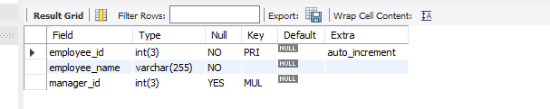
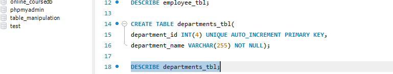
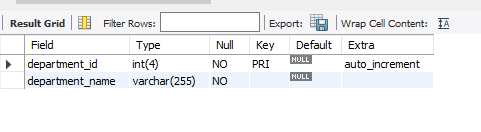
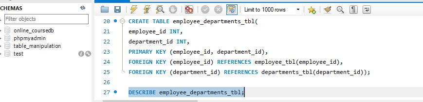
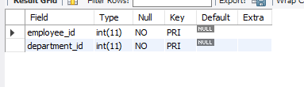
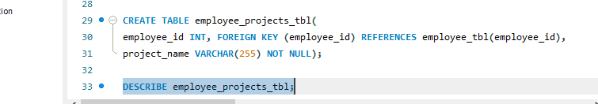
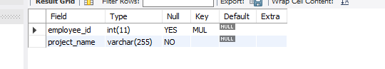
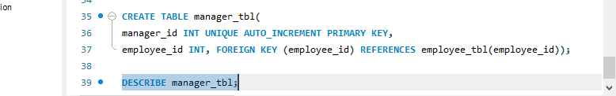
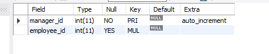
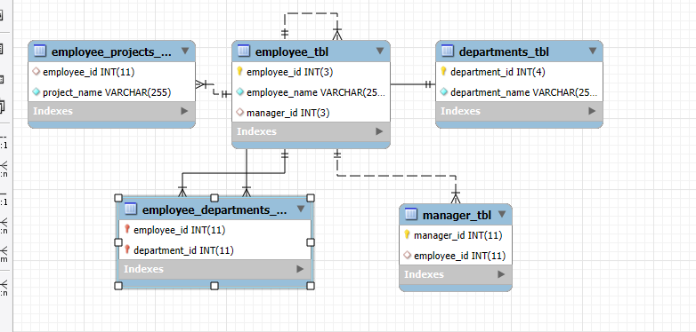

# Multi Level Company Database 
This project contains a basic relational database design for managing employee-related information in a company.
It includes employees, departments, managers, and their relationships with projects and departments.
---

## Database: MultiLevel_company

### Employees_Table

### Employees Table Structure 

### Departments_Table

### Departments Table Structure 

### Employee_Departments_Table

### Employees Department Table Structure 

### Employee_Projects_Table

### Employees Project Table Structure 

### Managers_Table

### Manager Table Structure 

### EER Diagram
This diagram shows a visual representation of the relationships among the tables.

