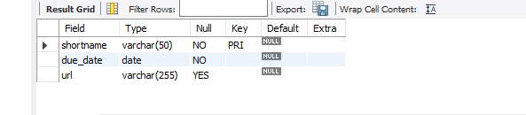

# Finals Task 2. Transforming ER Model to Relational Tables
For this task, we are given ER diagram representing student assignment submissions, convert it into MySQL tables. Capture all entities and their attributes, and define the relationships between students, submissions, and assignments. Identify the primary and foreign keys and ensure proper representation of any dependent or weak entities.
## Here's the screenshots of Query Statements (See screenshots)
**Student TABLE**

**Assignment TABLE**

**Submission TABLE**

## Here's the screenshots of Table Structure (See screenshots)

**Student TABLE**

**Assignment TABLE**

**Submission TABLE**

## Here's the ER Diagram or Relational schema 

