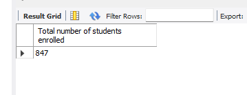

# Using select clause

## Query Statement 
### Query Statement Task 1

### Query Statement Task 2

### Query Statement Task 3

### Query Statement Task 4

### Query Statement Task 5

# Table Structure 
### Table structure 1

### Table structure 2

### Table structure 3

### Table structure 4

### Table structure 5

# SQL copy of the database and table structures

