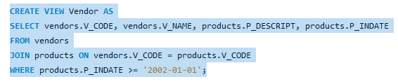
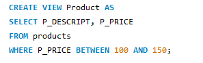
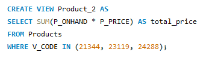
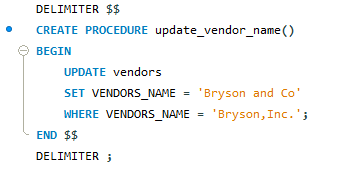
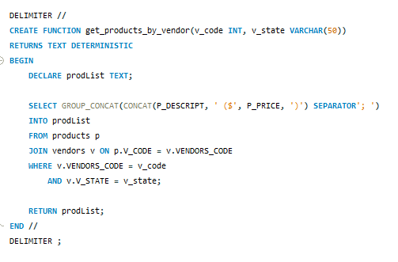
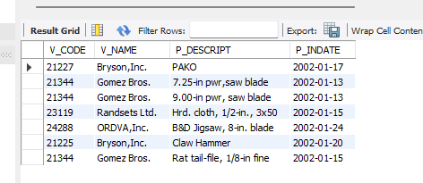
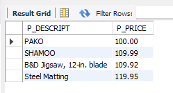
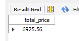
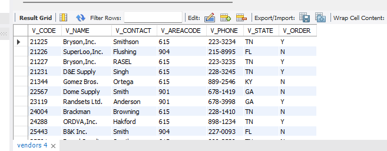
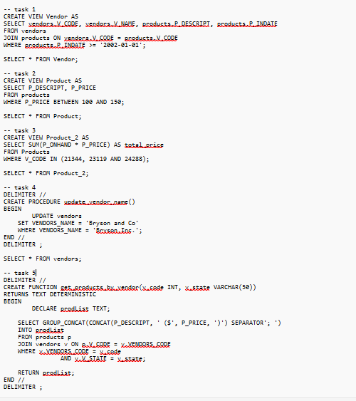

# Final Lab Task 5: Using SQL Views and Stored Procedures and Stored Functions

- For this task, we are given initial query creates reusable views, procedures, and functions to simplify querying and updating product and vendor data in the inventory database.

## Here’s the Query Statements

## TASK 1

## TASK 2

## TASK 3

## TASK 4

## TASK 5

## Here's the screenshot Table Structure 

## TABLE STRUCTURE 1

## TABLE STRUCTURE 2

## TABLE STRUCTURE 3

## TABLE STRUCTURE 4

# SQL COPY

