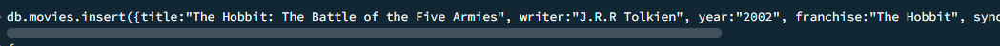

# Final Lab Task 6: MongoDB Practice
For this task, we are given initial query in order to used and develop hands-on skills in managing and querying data using MongoDB.

## Here’s the Query Statements

First, select the database you want to work with in MongoDB.

use mongo_practice
### Create Database

### Insert Documents

### Query Find
db.movies.find()

db.movies.find({writer:”Quentin Tarantino”})

db.movies.find({actors:”Brad Pitt”})

db.movies.find({franchise:”The Hobbit”})

db.movies.find({year:{$gt:”1990”, $lt:”2000”}})

db.movies.find({$or:[{year:{$gt:”2010”}},{year: {$lt:”2000”}}]})

### Update Documents

db.movies.update({_id:ObjectId(&quot;5c9f98e5e5c2dfe9b3729bfe&quot;)}, {$set:{synopsis:&quot;A reluctant
hobbit, Bilbo Baggins, sets out to the Lonely Mountain with a spirited group of dwarves to
reclaim their mountain home - and the gold within it - from the dragon Smaug.&quot;}})

db.movies.update({_id:ObjectId(&quot;5c9fa42ae5c2dfe9b3729c03&quot;)}, {$set:{synopsis:&quot;The dwarves,
along with Bilbo Baggins and Gandalf the Grey, continue their quest to reclaim Erebor, their
homeland, from Smaug. Bilbo Baggins is in possession of a mysterious and magical ring.&quot;}})

db.movies.update({_id:ObjectId(&quot;5c9f983ce5c2dfe9b3729bfc&quot;)}, {$push:{actors:&quot;Samuel L.
Jackson&quot;}})

### Text Search

db.movies.find({synopsis:{$regex:&quot;Bilbo&quot;}})

db.movies.find({synopsis:{$regex:&quot;Gandalf&quot;}})

db.movies.find({$and:[{synopsis:{$regex:&quot;Bilbo&quot;}}, {synopsis:{$not:/Gandalf/}}]})

db.movies.find({$or:[{synopsis:{$regex:&quot;dwarves&quot;}}, {synopsis:{$regex:&quot;hobbit&quot;}}]})

db.movies.find({$and:[{synopsis:{$regex:&quot;gold&quot;}}, {synopsis:{$regex:&quot;dragon&quot;}}]})

### Delete Documents

db.movies.remove({_id:ObjectId(&quot;5c9f992ae5c2dfe9b3729c00&quot;)})

db.movies.remove({_id:ObjectId(&quot;5c9f9936e5c2dfe9b3729c01&quot;)})

